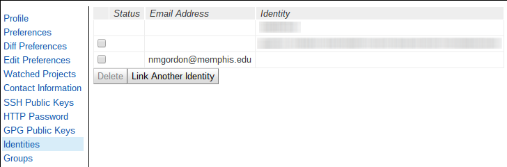
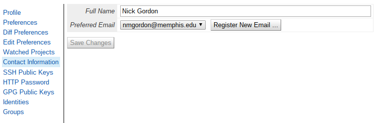

# Contributing to the NDN Codebase
## Getting Started

The NDN team is very glad you are interested in contributing! The NDN
(Named Data Networking) codebase is composed of many projects, with
multiple universities across the world contributing. This
documentation will help you understand how we work and what we expect
from contributors.

### Code of Conduct

NDN codebase development adheres to the Contributor Covenant, located
in `CODE_OF_CONDUCT.md`. By contributing, you are expected to also
adhere to this code. If you feel someone has breached this code of
conduct,
please
[email us](mailto:lixia@cs.ucla.edu,bzhang@cs.arizona.edu,aa@cs.ucla.edu).

### What can I do?

The NDN codebase continually needs help with, among other
things:

1.  Implementing new features
2.  Writing fixes for bugs
3.  Writing documentation for features that have recently changed or
    that change quickly. Sometimes people forget to update
    documentation!
4.  Code review

## Finding Documentation

The NDN team maintains a community
([Redmine site](https://redmine.named-data.net/projects/nfd)) for
issue tracking and documentation hosting. Redmine is the hub for
design activity. In particular, all design discussion and decisions
will either occur or be copied there.

**Why did they do it *this* way?** When writing code, if you ever have
questions about why some design decision was made, the best approach
is to use `git blame` on a file to inspect the last commit for some
line of code. In this view there will be a commit hash in hex
(e.g. `0ab12e3a`) in the first column. Using our example, `git show
0ab12e3a` would show the commit made for that line. In the commit view
there should be a reference number (e.g. `refs: #1234`). Using this
number, you can find a pertaining issue on the Redmine
(e.g., `https://redmine.named-data.net/issues/1234`).

Additionally, in some cases there are published papers you can read in
order to gain a better understanding of the project. Searching for
these papers is not difficult; in many cases you can find a pertaining
paper or technical report listed on
[the main NDN website](https://named-data.net/publications).
Usually the title of a project will be a good keyword.

If you cannot find an answer to your question, the best place to go is
the
[mailing lists](https://named-data.net/codebase/platform/support/mailing-lists/).
There are multiple different lists for different interests, so be sure you
are mailing the right list for a quick response.

## Tracking work on Redmine ##

As mentioned above, Redmine is the organizational hub of the NDN
projects. As such, extensive use of it is made, and learning how it
works will help you. In particular, there is a workflow associated
with Redmine. Generally it is:

1.  An issue is reported by someone. At this point they should
    describe the issue, including relationships to other
    issues. Unless they know what they're doing, they should leave
    particulars blank. Such particulars are priority, target version,
    assignees, and categories.
2.  Design discussion about the issue occurs, and the issue is either
    accepted or rejected.
3.  Someone either is assigned to, or assigns themselves to work on the
    issue, setting the status to "In progress."
    **Note:** You must be a "Developer" of the project before you are
    able to toggle the Status field. A user should contact a project
    manager to be granted Developer privilege. Project managers can be
    found on "Overview" page of the project.
4.  After every useful chunk of progress, notes are made on the issue
    and the progress percentage is updated to reflect this. Remember
    that notes are actually Markdown, so it is advised to use the
    'preview' button to ensure your note looks right.
5.  The changes are uploaded to Gerrit for review. Once all changes
    pertaining to an issue are on Gerrit, an issues status should
    change to "Code review."
6.  Once all changes are cleared for merging, they either can be
    merged, or held for feedback, at which point the issue status
    should become "Feedback."
7.  After all changes have been merged, the issue should be set to
    "Closed."

Redmine provides other facilities for managing your work on NDN
projects, too, such as time logging and time estimation.

## Contributing Guidelines

### Repositories ###

All NDN projects are hosted on GitHub, at various organizations, using git
for version control:

- [Main NDN codebase](https://github.com/named-data)
- [NDN codebase for mobile platforms](https://github.com/named-data-mobile)
- [NDN codebase for IoT](https://github.com/named-data-iot)
- [ndnSIM codebase](https://github.com/named-data-ndnSIM)
- [Other NDN codebase (REMAP)](https://github.com/remap)

If you are unfamiliar with git, some kind
of [tutorial on git](https://git-scm.com/book/en/v1/Getting-Started)
should be your first step.

There is also a [Git game](http://learngitbranching.js.org/index.html)
you can play. Finally, there is a
[wiki page](https://redmine.named-data.net/projects/nfd/wiki#Development-process)
on NFD's Redmine that has more useful links.

There are a lot of different projects, so take some time to look
through them for ones that pertain to your interests. NDN projects
use [Gerrit](https://gerrit.named-data.net/) for code review purposes.

Occasionally there will be other repositories used privately to test
changes, but this is uncommon. In general, you will not need to refer
to these repositories.

### Style ###

Most NDN projects are written in C++, and there is a
[style guide](https://named-data.net/doc/ndn-cxx/current/code-style.html).
In general the NDN style is similar to the GNU style, but there are
some significant changes. This style guide is not exhaustive, and in
all cases not covered by the guide you should emulate the current
style of the project.

There is a
[partial styleguide](https://redmine.named-data.net/projects/nfd/wiki/CodeStyle)
for Python. It applies many of the provisions from the C++ guide, in
addition to some other Python-specific things.

Some NDN projects are writtin in JavaScript, and there is a [style guide](https://named-data.net/codebase/platform/documentation/ndn-platform-development-guidelines/cpp-code-guidelines/) for that language, too.

#### Commit Messages ####

Commit messages are very important, as they are usually the first
thing (besides the changelog file) a developer looks at when trying to
understand the timeline of a project. Commit messages should:

-   Have a short, descriptive first line, starting with the module
    they change. A good rule of thumb is a maximum length of 65
    characters.
-   If including a body, leave a blank line between the first line and
    the rest, and ensure that it's no longer than 72 characters.
-   Include Redmine issue numbers. The exact syntax is given below.
-   Be written in an imperative mood. E.g. `"Make foo a bar"` and not
    `"Foo is now a bar"`
-   Use the present tense. E.g. `"Make foo a bar"` and not `"Made foo a
    bar"`

To explain, the anatomy of a typical commit message is like this:

    docs: write contributing guide and code of conduct

    refs: #3898
    Change-Id: Ife89360305027dba9020f0b298793c1121ae1fd6c

Explaining this:

-   `docs` is the module that the commit affects. We want this because
    it lets someone know at a glance what part of the project it
    changes. For some projects, there will be only one module or only
    very small other modules. This practice should be observed in
    those cases, too.
-   `#3898` is the Redmine issue number. Gerrit transforms these into
    clickable links, and it is useful to reviewers to gain background
    understanding of the issue. You can have multiple by separating
    them with commas.
-   `Change-Id` should be filled automatically. It is used by Gerrit
    to track changes.

### Unit Tests ###
With a few exceptions, every patch needs to have unit tests that
accompany them. For C++, we use
the [Boost unit test framework](http://www.boost.org/libs/test) to
help us out. Note that this link points to the newest version of the
Boost Test library documentation, and you may need to refer to older
documentation if you are using an older version of Boost. More
information on this is available in
the
[NFD Dev Guide](https://named-data.net/publications/techreports/ndn-0021-7-nfd-developer-guide/)

When designing and writing tests, a few things need to be kept in mind:

1.  Unit tests are **design** tools, *not* debug tools. Just because
    your code passes some unit tests does not mean it is
    bug-free. Unit tests are tools to convince you that your code does
    what you think it does.
2.  It can be difficult to know when you should test something. If
    you find that you are having a hard time designing a test for
    something, ask yourself whether it is because it doesn't make
    sense to test what you've just written, or if it's because the way
    you designed it makes it difficult to test. Consider a second look
    at your design if you think it's the second one.
3.  The method that gave the world unit tests says that unit tests
    should be written *before* the code they test. This is
    a contentious issue, so writing them either before or after is
    acceptable. If writing them later, keep the tests in mind when
    writing the code, and it will help design good interfaces.
4.  At the very least, write the test for a completed module/unit of
    code before moving on. Doing this will ensure that the test gets
    written, and will help you think about the interface that you need
    to examine. If you don't, you may forget exactly what each piece
    is responsible for when you're looking at the whole system
    afterward.
5.  Separate your I/O, as it is very hard to test, so I/O should be
    isolated if possible. Consider something like separating a
    function that invokes I/O into two functions: one that does the
    I/O and calls the other one, which takes that I/O result. This
    will make it easier to test that second function than if they were
    combined.

Writing unit tests using the Boost framework is quite simple, and you
can refer to existing unit tests for examples.
([This is a good example.](https://github.com/named-data/NFD/blob/master/tests/rib/rib.t.cpp))

#### Building and running unit tests ####
This is mentioned in greater depth in
the [developer's readme](README-dev.md), but the basic procedure is:

1.  In the base directory of the project, run `./waf distclean`. This
    removes all prior build files.
2.  Run `./waf configure --with-tests`. This configures the next build
    to also build the tests.
3.  Run `./waf`. This will build the tests.
4.  Then, the unit tests will be in the `build` directory, and will be
    named `unit-tests-<module name`, e.g. `unit-tests-nlsr` or
    `unit-tests-rib`. To run just one test suite, run
    `./unit-tests-exampleModule -t ExampleTestSuite`. To run a
    specific test in a suite, use `./unit-tests-exampleModule -t
    ExampleTestSuite/ExampleTestCase`.

## Gerrit: Uploading Patches and Code Review ##

As mentioned above, NDN projects
use [Gerrit](https://gerrit.named-data.net/) for code review. This is
a web-hosted, open code review platform that allows for interactive
code review, rebasing, and cross-linking with the Redmine, and a
developer interacts with it using the familiar git. For issues that
require a tracker reference, a particularly useful feature is that
the `refs: #...` becomes a clickable link to the issue for design
discussion.

### First-time Setup ###

The first-time Gerrit setup goes like this:

1.  Log in to Gerrit. You can authenticate using many different
    methods, including GitHub OAuth. You need to ensure that you have a Gerrit username:
    1. Log in.
    2. Click on your name in the top right corner and click "Settings" in the pop-up box.
    3. In the `Username` box, check for a name. If there's already one there, great.
    4. If not, type one in, and this will be used in later steps.

2.  Set up your Gerrit credentials. This will depend on how you
    configured your Gerrit remote in step 1. Among other things, you
    need to set up identities so that the email on your Gerrit profile
    matches whatever email you will be committing with on your git
    repo.
    **Note:** We only support using
    [SSH access to Gerrit](https://gerrit.named-data.net/Documentation/user-upload.html#ssh).

    This shows what the identities panel looks like. If you do
    not see the email here that you have configured git to use, you
    cannot upload to Gerrit.
    

    In that case, add it under contact information panel.
    .

    Gerrit itself has
    [extensive documentation](https://gerrit.named-data.net/Documentation/error-messages.html)
    regarding error messages, and this identity-based one is by far the most
    common. This is the
    [documentation for an identity error.](https://gerrit.named-data.net/Documentation/error-invalid-author.html)

3.  Clone the source for a project from Gerrit.
    1. While logged in to Gerrit, there will be a link in the top-left
       area, `Projects`.
    2. From this project view, click on the `Clone with commit-msg
       hook` tab.
    3. Click on the `ssh` tab to select cloning over SSH. **Note:**
       This will require setting up SSH access to Gerrit first.
    4. Copy-and-paste the `git clone ...` command into your terminal
       to fetch the project source.

    After this, your remotes will be set up correctly, and pushing to
    Gerrit will only require `git push origin HEAD:refs/for/master` after
    committing work.  This section has some
    [git tips and tricks to type less][type-less].

### Uploading patches ###

Most patches should have a corresponding Redmine issue that they can
reference. If you search the Redmine and notice there is no relevant
issue for a patch you are writing, please create an issue first. You
will need a Redmine account, which can be created there.

After writing some changes, commit them locally as normal. After
saving and exiting your editor, the commit hook will insert a unique
`Change-Id` to the message.

Once you have a commit message you are happy with, simply run `git
push HEAD:refs/for/master`.

**Note:** Gerrit separates commits into patch sets by the unique
`Change-Id`s. As a result, it is important that you either:

*  Squash your various commits into one with `git rebase -i
   <initial commit>`, ensuring that the ultimate `Change-Id` in the
   commit is the one on the patch set on Gerrit. This workflow is
   generally preferred.
*  Amend your commit with any new changes using `git commit --amend`.

If you do not do this, what will happen is that each commit will be
interpreted by Gerrit as a separate patch set. This is probably not
what you want.

### Code Review ###
#### Dealing with Code Review ####

It is important to remember that code review is about improving
the quality of code contributed, and nothing else. Further, code
review is highly important, as every line of code that's
committed comes with a burden of maintenance. Code review helps
minimize the burden of that maintenance. Consider that when you
are receiving comments, those comments are influenced by two
things:

-  How the reviewer personally feels about the change ("Would I
   be happy to see this code in a year?" or "Would I be happy if
   I wrote this?") and
-  How the reviewer feels the change abides by style and usage
   requirements ("I may not personally mind, but we have to do it
   this way.")

Remembering these things when reading comments helps to separate
what can feel like needless negativity.

#### Doing Code Review and Writing Comments ####

**Code review is *extremely* important!** We need every bit of code
 review you can give. In many cases this is the bottleneck for
 new contributors who do not fully understand how certain
 language constructs should be used, what best practices are,
 etc. In these cases it is important to give constructive
 feedback.

Writing comments is somewhat counter-intuitive on Gerrit. If you are
signed in through a modern browser, you can leave a comment in a file
either by clicking on the line number, by selecting some text you want
to comment and pressing 'c', or by clicking on someone else's
comment. After typing, click the `Save` button there. After navigating
through the patch set with the arrows at the top-right of the Gerrit
UI, you then must click the up-arrow to get back to the Change
screen. **At this point your comments have *not* been made yet!** You
must then click the `Reply...` button, and assign a score. If you
correctly saved your comments, they will be shown at the bottom of
that box. Once you click post, the comments will be made public to
others.

Minimally, a review *must* include:

-   A score (usually -1, 0, or +1)
-   An "itemized" commentary on each objection you have, or a
    justification for a whole-change objection.

Optimally, a review should include:

-   A useful explanation of *why* you object to some item. This is
    more important than it first appears. Consider that although
    you may have been writing code since before you could count,
    not everyone has. Some things may not be obvious to others,
    and sharing your knowledge is key to making an open-source
    project work.
-   Comments about good design decisions. These help motivate
    developers when otherwise a review is entirely negative
    comments.

#### Expediting the Code Review Process ####

If you observe that code review takes a long time, there are a
few things that you can do to to expedite the process:

1.  **Think about language best practices.**
2.  **Ask yourself how you would feel about this code, if you saw it "in the wild."**
3.  **When making code decisions, ask yourself "why *shouldn't* I do it this way?"**

#### Responding to Code Review ####

There are a few things to remember when responding to code review, including:

-  **Don't** click "Done" on a comment if you agree with a comment and
   are updating the code accordingly. These comments are essentially
   useless and only clutter the discussion. Gerrit has a convenient
   mechanism to check the differences between two patch sets, so
   reviewers are expected to check that their comments have been
   addressed.
-  **Don't** blindly follow what is suggested. Review is just that: a
   review. Sometimes what is suggested is functionally equivalent to
   what you have implemented. Other times, the reviewer has not
   considered something when writing their review, and their
   suggestion will not work. Lastly, if you disagree with a suggestion
   for some other reason, feel free to object, but you may be asked to
   provide an explanation.
-  **How** to reply. To reply to a comment, click on the comment in
   the Gerrit interface, type your reply, and then press save. After
   replying, you **must remember** to go to the main patch set change
   screen, and press `Reply...`. Your comments will be shown as
   drafts, and you must click `Post` to make them visible to others.

### Jenkins ###

As a supplement to the code review process, every patch set is automatically
compiled and tested on multiple platforms
using [our instance of Jenkins](http://jenkins.named-data.net/), the
continuous integration system. Interacting with Jenkins is not usually
necessary, as Jenkins automatically picks up new patch sets and posts
the results. Typically the only interaction needed with Jenkins is
when some kind of glitch occurs and a build needs to be retriggered.

It is expected that code is checked locally. Reviewers may wait until
Jenkins checks the code before doing a more functional review of the
code. Since Jenkins checks can take a while, you can save some time by
checking yourself first.

### Gerrit Change-Id Commit Hook ###

If you encounter an error like this when trying to push work:

        remote: ERROR: [4311462] missing Change-Id in commit message footer
        remote:
        remote: Hint: To automatically insert Change-Id, install the hook:
        remote:   gitdir=$(git rev-parse --git-dir); scp -p -P 29418 someuser@gerrit.named-data.net:hooks/commit-msg ${gitdir}/hooks/
        remote: And then amend the commit:
        remote:   git commit --amend

Then your commit hook has not been set up correctly, somehow. Follow
the instructions in the terminal to resolve this.

### Code Style Robot ###

As part of CI, there is a script that checks every patch uploaded to
Gerrit for code style consistency. Checking these kinds of things is
notoriously difficult, and while the robot is very good in general, it
will occasionally report false positives and miss things. So all
issues it raises should be inspected manually to ensure they really
are style problems. Further, since this automated check is not
perfect, you should take steps (e.g., configure your editor or run a
linter before you commit) to ensure you adhere to code style rules.

###  Typing Less to Upload Patches to Gerrit ###

If typing `HEAD:refs/for/master` feels
repetitive, you have a few options:

*  You can configure git to do the work for you, as described
   in [this blog post](https://yoursunny.com/t/2017/NFD-devbox/#Uploading-to-Gerrit)

*  Git has an alias system that you can use to specify certain
   commands. For example, you can use `git config --global alias.pg
   "push origin HEAD:refs/for/master"` to make `git pg` push to Gerrit. You
   can [learn about git aliases.](https://githowto.com/aliases)

*  If using Linux or macOS, it is relatively simple to create a shell
   alias: `alias gs="git status"` for example, or `alias gitpush="git
   push origin HEAD:refs/for/master`. The alias itself must be one
   word, but it can represent multiple words. To persist your
   aliases, they need to go in your environment file, which is
   generally at `~/.bashrc` or `~/.zshrc` or `~/.profile`. The exact
   syntax of aliases and the environment variables file will vary by
   shell. You should be careful not to overuse aliases, however.

[type-less]: #type-less
